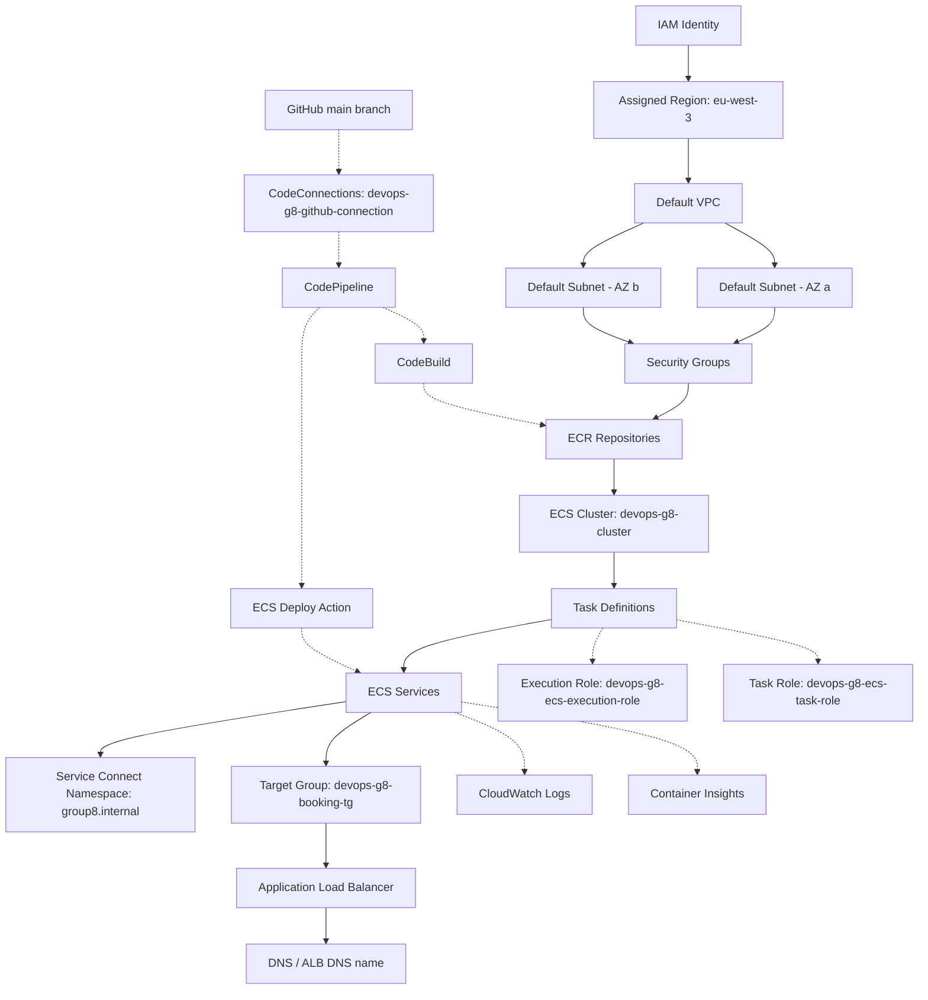
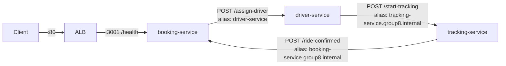

# Gate 1 — Draw the Graph

**Group:** devops-g8 · **Region:** eu-west-3 · **Account:** 827478161993
**Team:** Glory (booking-service), Hawaah (driver-service, platform), Conslate (tracking-service)
**Last updated:** 2026-07-23

---

## Executive summary

Group 8 rehosted a three-service ride-hailing application (booking → driver → tracking,
with a callback loop back to booking) from a local Nginx/systemd deployment onto AWS
ECS Fargate, fronted by an Application Load Balancer and wired internally with ECS
Service Connect.

**Current state, verified against live infrastructure, not assumptions:**

| Area | Status |
|---|---|
| Hosting (ECR, ECS cluster, task definitions, 3 services running) | ✅ Live and healthy |
| Wiring (Security groups, Service Connect namespace, ALB target group) | ✅ Live, rule-by-rule audited against this contract |
| Runtime security proof (Gate 2) | ✅ Complete — see `GATE2_EVIDENCE.md` |
| Application-level reliability | ⚠️ Two real defects found and diagnosed via evidence, one fixed live, one open — see `SCAR_LOG.md` |
| CI/CD pipeline (Ship It) | 🟡 In progress — CodeConnections, CodeBuild, and CodePipeline exist for booking-service and driver-service; tracking-service pipeline not yet built |
| Resource-naming consistency | 🟡 One inconsistency identified and runbooked below, pending execution by the resource owner |

This document is the team's Gate 1 planning reference (dependency graph, failure
predictions, traffic contracts, ownership, naming) plus a running record of what has
since been verified true or corrected against the real system. Two companion
documents complete the submission: `GATE2_EVIDENCE.md` (positive/negative runtime
proof) and `SCAR_LOG.md` (diagnosed failures, root causes, repairs).

> **Note on sequencing:** the assignment expects this document before any AWS
> resources are created. In our case, the ECS/ALB/Service Connect infrastructure was
> already live when this document was written and verified. It's presented here as
> the reference the team should have agreed on first, with live-system verification
> layered on top — call this sequencing out to the reviewer rather than presenting it
> as having preceded the build. Engineering discipline here comes from the fact that
> every claim below was checked against the real system, not from pretending the
> planning happened before the infrastructure did.

---

## 0. Ownership map

| Role | Owner | Responsibilities |
|---|---|---|
| Service A owner (booking-service) | Glory (Wachira-glory) | Image, ECR, task definition, security group, ECS service, pipeline |
| Service B owner (driver-service) | Hawaah (Hawa Majid) | Image, ECR, task definition, security group, ECS service, pipeline |
| Service C owner (tracking-service) | Conslate (Conslate Koyo) | Image, ECR, task definition, security group, ECS service, pipeline |
| Platform owner | Hawaah (Hawa Majid) | Cluster, namespace, ALB, target group, CodeConnections |

Hawaah currently holds both the driver-service and platform roles. The assignment's
3-person-team rule expects the platform role to rotate specifically so that no single
person becomes the only one who understands the shared infrastructure — "knowledge
concentrated in one person" caps the overall score at 70%. **Action for the team:**
agree on a rotation point (e.g., Hawaah hands off platform ownership to Glory or
Conslate after Gate 2) before Demo 1, and make sure at least one other teammate can
answer platform-level questions (cluster, ALB, Service Connect, CodeConnections) cold.

---

## 1. Resource naming

Every resource is prefixed `devops-g8-`. Verified live names:

| Resource | Name |
|---|---|
| ECR repos | `devops-g8-booking-service`, `devops-g8-driver-service`, `devops-g8-tracking-service` |
| ECS cluster | `devops-g8-cluster` |
| ECS services | `devops-g8-booking-service`, `devops-g8-driver-service`, `devops-g8-tracking-service` |
| Task definitions | `devops-g8-booking-service-task`, `devops-g8-driver-service` ⚠️, `devops-g8-tracking-service-task` |
| Service Connect namespace | `group8.internal` |
| ALB | `devops-g8-alb` |
| Target group | `devops-g8-booking-tg` |
| Security groups | `devops-g8-alb-sg`, `devops-g8-booking-service-sg`, `devops-g8-driver-service-sg`, `devops-g8-tracking-service-sg` |
| IAM roles | `devops-g8-ecs-execution-role`, `devops-g8-ecs-task-role` |
| CodeConnections | `devops-g8-github-connection` (AVAILABLE) |
| CodeBuild projects | `devops-g8-booking-service-build`, `devops-g8-driver-service-build` |
| CodePipeline | `devops-g8-booking-service-pipeline`, `devops-g8-driver-service-pipeline` |

Required tags on every resource:

| Key | Example |
|---|---|
| Project | `devops-mentorship` |
| Group | `group-8` |
| Owner | `booking-service-owner` / `driver-service-owner` / `tracking-service-owner` / `platform-owner` |
| Environment | `lab` |

### Naming inconsistency — driver-service task-definition family

`driver-service`'s task-definition family is registered as `devops-g8-driver-service`,
missing the `-task` suffix the other two services use
(`devops-g8-booking-service-task`, `devops-g8-tracking-service-task`). Cosmetic, but
worth fixing for consistency before final review.

**Why this is safe to fix, verified before recommending it:**
- ECS task-definition family names are immutable — fixing this means registering a
  *new* family and moving the service onto it, not renaming in place.
- Checked `devops-g8-driver-service-pipeline`'s deploy stage configuration directly:
  it targets `ClusterName: devops-g8-cluster` / `ServiceName: devops-g8-driver-service`
  only. It does not reference the task-definition family anywhere, so once the
  service points at the new family, the pipeline automatically registers future
  revisions under it — no pipeline reconfiguration required.
- With the deployment circuit breaker enabled, the cutover is a standard ECS rolling
  deployment: the new task starts and must pass health checks before the old one is
  stopped, and ECS auto-rolls-back if it doesn't.

**Runbook** (this is driver-service's owned resource — Hawaah should execute it,
per the team's "advise but don't operate another owner's console" rule):

1. Register the new family. The exact task definition — same image, env vars, port
   mapping, and health check as the current live revision — is committed at
   [`docs/runbooks/driver-service-taskdef-rename.json`](runbooks/driver-service-taskdef-rename.json):
   ```
   aws ecs register-task-definition \
     --cli-input-json file://docs/runbooks/driver-service-taskdef-rename.json
   ```
2. Point the service at it:
   ```
   aws ecs update-service --cluster devops-g8-cluster \
     --service devops-g8-driver-service \
     --task-definition devops-g8-driver-service-task:1
   ```
3. Wait for steady state:
   ```
   aws ecs wait services-stable --cluster devops-g8-cluster \
     --services devops-g8-driver-service
   ```
4. Verify:
   ```
   aws ecs describe-services --cluster devops-g8-cluster \
     --services devops-g8-driver-service \
     --query "services[0].{Running:runningCount,TaskDef:taskDefinition}"
   ```
5. Optional cleanup, once confirmed stable: the old family
   (`devops-g8-driver-service`, 10 accumulated revisions) can be deregistered —
   it costs nothing to leave, so this is low priority.

**Status: not yet executed.** Logged here as a ready-to-run runbook, not applied,
pending Hawaah's go-ahead.

---

## 2. Dependency graph



**Service-level detail** (what Service Connect and the ALB actually wire together,
using the real, verified Service Connect client aliases — see the callout below for
why these being inconsistent mattered):



Note this system is not a strict straight line — tracking-service calls **back** to
booking-service to close the loop (`/ride-confirmed`), which is why booking-service's
`/request-ride` holds the connection open (10s timeout) waiting on that callback. This
callback edge is exactly where a real production bug was found and fixed — see
`SCAR_LOG.md` Scar #1.

---

## 3. Dependency questions

| Question | Answer |
|---|---|
| What must exist before a Fargate task can start? | VPC + subnets, security group, task definition (valid execution role), and an available ECR image referenced by that task definition |
| What must exist before ECS can pull an image? | ECR repository with a pushed, tagged image, and an execution role with `ecr:GetAuthorizationToken` / `ecr:BatchGetImage` / `ecr:GetDownloadUrlForLayer` |
| What must exist before the ALB can route traffic? | Target group registered with the ALB listener, and at least one healthy target (running task with a passing health check on the named container port) |
| What depends on the named container port? | The ALB target group registration, the Service Connect port mapping name, and the health check command inside the task definition — all three must agree |
| Which resources survive task replacement? | ECR images, task definition revisions, ECS service, security groups, ALB, target group, Service Connect namespace, CloudWatch log group |
| Which resources generate cost while idle? | Fargate tasks (desired count > 0), the ALB itself, CloudWatch log ingestion/storage, ECR storage, Container Insights metrics — see cost sweep in Phase 6 |

---

## 4. Failure predictions

| Broken edge | Expected user symptom | Expected AWS evidence |
|---|---|---|
| ECS Task → ECR (image pull) | Task never reaches RUNNING; ALB shows no healthy targets | ECS service events / stopped-task reason: `CannotPullContainerError`; task stopped reason references the image URI |
| ALB Target Group → Container port/health path | `curl` to the ALB times out or returns 5xx from the ALB itself (no backend to route to) | Target group shows targets stuck in `unhealthy` with reason `Health checks failed`; ECS service events show repeated task replacement |
| Service Connect (driver-service → tracking-service, or any client-alias mismatch) | `/request-ride` returns a `504`-style error (booking-service's callback timeout fires) even though all three tasks are RUNNING and healthy individually | CloudWatch logs show a connection-level error (e.g. `fetch failed`) on the calling side, not an application error; ECS events show all tasks healthy, proving the break is at the discovery/DNS layer, not the compute layer |

**This is not hypothetical.** The third prediction is exactly what happened during
Gate 2 evidence capture: a live `/request-ride` failed with the predicted symptom,
diagnosed via the predicted evidence, and traced to a Service Connect alias
mismatch. Full trace, root cause, and repair are in `SCAR_LOG.md` Scar #1.

---

## 5. Traffic contracts

```
Internet → ALB → booking-service → driver-service → tracking-service
                                                            │
                                                            └──→ booking-service (callback)
```

No other application path is permitted.

| Source | Destination | Port | Allowed? | Enforcement |
|---|---|---|---|---|
| Internet | ALB | 80 | Yes | ALB security group |
| Internet | booking-service | 3001 | No | booking-service SG |
| Internet | driver-service | 3002 | No | driver-service SG |
| Internet | tracking-service | 3003 | No | tracking-service SG |
| ALB | booking-service | 3001 | Yes | ALB SG → booking-service SG |
| booking-service | driver-service | 3002 | Yes | booking-service SG → driver-service SG |
| booking-service | tracking-service | 3003 | No | no matching rule |
| driver-service | tracking-service | 3003 | Yes | driver-service SG → tracking-service SG |
| tracking-service | booking-service | 3001 | Yes | tracking-service SG → booking-service SG (callback path) |

> This last row is specific to this app's design — unlike the assignment's generic
> A→B→C example, tracking-service calls **back** to booking-service, so the security
> group rule set needs an explicit tracking→booking allow, not just a one-way A→B→C.

**✅ Verified, not assumed.** Every row above was checked directly against the live
security-group rules and confirmed to match exactly — see `GATE2_EVIDENCE.md` for the
full rule dump and the external positive/negative connection tests (ALB reachable,
all three app ports unreachable from the internet, confirmed by real `curl` attempts
against each task's public IP with observed connection timeouts).

Per-pair contract detail, using the **actual registered Service Connect client
aliases** (pulled live, not assumed):

| Pair | Protocol | Port | Service Connect alias (as registered) | Health endpoint | Timeout |
|---|---|---|---|---|---|
| ALB → booking-service | HTTP | 3001 | n/a (ALB target group) | `/health` | ALB default (5s interval) |
| booking-service → driver-service | HTTP | 3002 | `driver-service` (short name) | `/health` | 2s (health check), no explicit timeout on `/assign-driver` call |
| driver-service → tracking-service | HTTP | 3003 | `tracking-service.group8.internal` (namespace-qualified) | `/health` | 2s (health check), no explicit timeout on `/start-tracking` call |
| tracking-service → booking-service | HTTP | 3001 | `booking-service.group8.internal` (namespace-qualified) | n/a (one-way callback) | none set — booking-service's own 10s pending-callback timer is what bounds this |

> **Why the alias column says "as registered" instead of a clean convention:** the
> three services were not registered with a consistent naming convention — two use
> the full namespace-qualified DNS name, one uses the short name. This inconsistency
> is exactly what caused Scar #1 (tracking-service's env var used the short-name form
> for booking-service, which was never registered under that form). The mismatch has
> been fixed for the tracking→booking leg. **Recommendation for the team:** standardize
> all three on one convention (namespace-qualified is safer, since it's explicit) to
> prevent this class of bug recurring if aliases are ever re-registered.

**Lab networking note:** tasks run in default public subnets with public IP assignment
enabled for outbound access. Public IP ≠ publicly permitted — the security groups above
are what actually block direct inbound access to driver-service and tracking-service,
and this was proven by live connection attempts, not just rule inspection.

---

## 6. Known application-layer issues (see `SCAR_LOG.md` for full detail)

Gate 1/2 evidence work surfaced two real defects in the running system — exactly the
kind of finding this phase is designed to catch before Gate 3 demos:

1. **Scar #1 — Service Connect alias mismatch (fixed).** tracking-service couldn't
   call back to booking-service because of the naming inconsistency above. Fixed by
   updating tracking-service's `SERVICE_A_URL` to the correct namespace-qualified
   alias; verified live with a follow-up request.
2. **Scar #2 — in-memory callback state doesn't survive horizontal scaling (open).**
   booking-service runs at desired count 2, but holds pending-ride state in a
   process-local `Map`. When tracking-service's callback lands on the *other*
   booking-service replica, the original request times out. Confirmed empirically:
   3 of 5 consecutive live requests failed. This requires an application-code fix in
   booking-service (Glory's owned service) — not something to patch unilaterally.
   Options and tradeoffs are recorded in `SCAR_LOG.md`.

---

## 7. Open items

- [x] Team to fill in the ownership table (Section 0) with actual names — **done**
- [x] Confirm the SG rules match reality — **done**, see `GATE2_EVIDENCE.md`
- [ ] Execute the driver-service task-definition rename runbook (Section 1) — Hawaah
- [ ] Decide platform-role rotation schedule for the 3-person team
- [ ] Fix Scar #2 (booking-service shared-state bug) — Glory, or a team decision on
      how to handle it before demo (see `SCAR_LOG.md` for options)
- [ ] Build a CI/CD pipeline for tracking-service to match booking-service and
      driver-service (CodeConnections and CodeBuild/CodePipeline patterns already
      established by the other two — replicate for tracking-service)
- [ ] Standardize Service Connect client-alias naming convention across all three
      services (see callout in Section 5)
